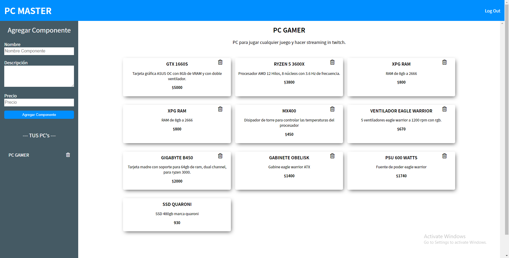

# Aplication to save yours PC MASTER's




# Techs
- PHP
- JS
- MYSQL
- AJAX
- CSS
- HTML
- MVC

# INSTRUCTIONS
You have to create a php file called "db_connection.php" in functions folder and write the code below (corresponding to your db).
```php
<?php
    $conn = new mysqli("your_host","your_user","your_password","your_dn");
    if($conn->connect_error){
        echo $conn->connect_error;
    }
?>
```
*You can find the sql code in the file *db.sql**